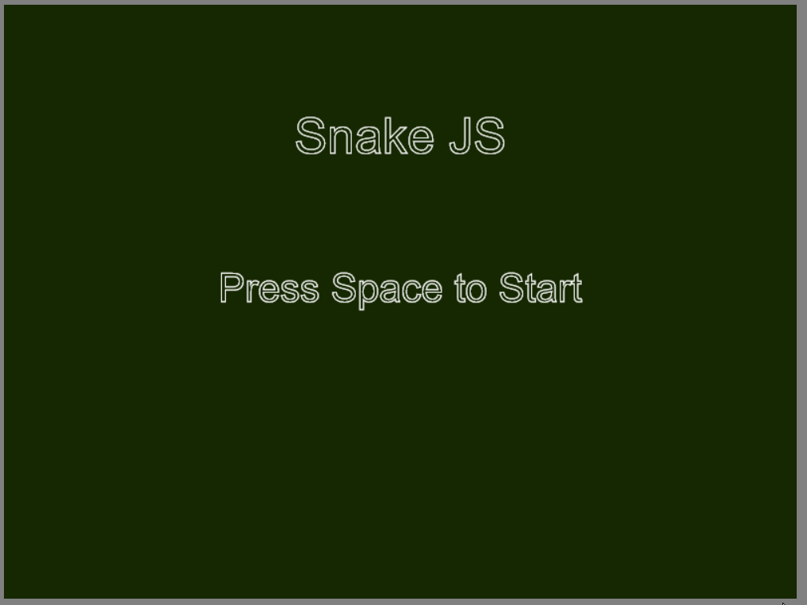

# SnakeJS

## Created using Canvas and HTML5.  
SnakeJS is a JavaScript take on the classic snake game, where the objective is to collect the food pellets, which cause your character to grow by a block size, and ultimately avoid obstacles.  

## ES6
The app uses es6, which allows nice code sugar such as the class keyword. With classes, basic OOP concepts were used (limited OOP due to JavaScript).  
One can also find design patterns utilized such as Command and State.  

## Design Patterns
### Command Pattern
The Command pattern is used to encapsulate keyboard presses and which action should be executed for a given input. For instance, the space key is used to start the game. However, the space bar should not be available during the actual game, so the code is designed to keep keyboard objects in GameState objects.  

### State pattern
The State pattern is used to transition between different game states, such as the MainMenu or MainGame states. GameStates have game objects and a keyboard, which they define in their constructor. Game states are also responsible for implemeting game logic, collision checking, movement, and drawing member methods.
Changing states is done by a concrete state class, in which then the Game object will detect a state change and perform the state change itself.  

### Visitor patter
Future iterations of the game will attempt to use the visitor pattern (or one like it) for collision handling.
However, for the time being, collision checking is done via the naive, bruteforce way (which is fine given the small amount of collidable objects in this app).

## Datastructures
Other concepts such as basic datastructures are used in this app also.  

### Linked List

One notable data scrtucture is the linked list. For the actual snake, this is a class that controls a linked list of body node objects. Drawing is done by iterating through the list. Movement is done by updating a previous node with the current nodes position. This way, movement has a kind of 'trickle down' effect. Adding a new node was as simple as finding the last body piece, and creating a new body object as the next pointed object. Linked list made implementing control logic for the snake much easier and elegant. 